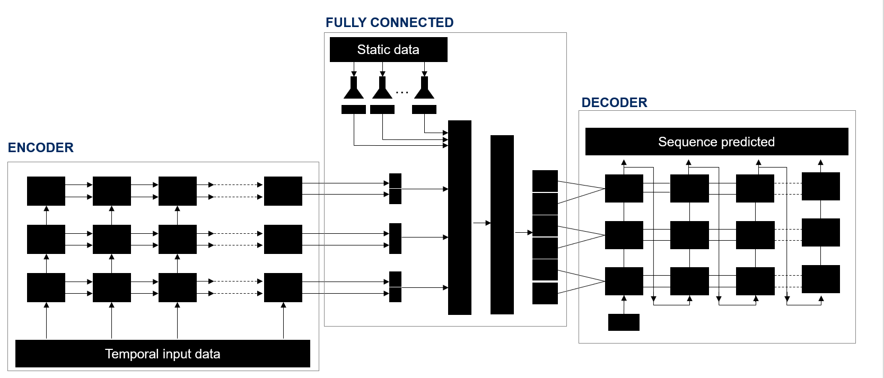

# Corporación Favorita Kaggle Competition - an end-to-end Demand Forecast solution using Deep Learning
In this repository I implement an RNN-based solution for demand forecast using Tensorflow. This was intended to be a proof of concept for understanding how good a recurrent neural network can perform in this set of tasks. A 50% MAPE has been achieved when predicting at a daily level and a 35% when aggregating this prediction at a weekly level.

## Technical solution
The problem has been solved using a complex neural network architecture. It is basically a seq2seq network in which the sequential input data summarizing the historical information of each store-sku pair is feed into the encoder network, the static input data is feed into the fully connected module

The architecture contains 3 blocks.
- Encoder: consists of a recurrent neural network which is responsible for summarizing the historical information of each store-sku pair into a vector of characteristics (the hidden states of the LSTM). The output of this neural network is not used.
- Fully connected: is a set of fully connected layers responsible for injecting the static data into the network for enriching the prediction. It takes as input the hidden state of the Encoder along with the raw static input data. It generates an RNN hidden state-like output.
- Decoder: consists of a recurrent neural network which takes the output of the fully connected module as an input and generates the predicted sequence.

## Installation and requirements
1) The following libraries have to be installed before running the code.
- tensorflow
- numpy
- pandas
- scikit-learn
- tqdm
- matplotlib

2) A `settings.json` file has to be created in the root of the repository which will contain some general configuration parameters. Please check the `settings_template.json` file as an example

3) Create a folder in the root of the repository with name `input`, and dump there all the files downloaded from the [Corporación Favorita Kaggle Competition](https://www.kaggle.com/c/favorita-grocery-sales-forecasting/data)

4) Run tensorboard setting the propper logs directory (the same you specified into the `settings.json` file

5) Open an `ipython` console on the root of the repository and run `%run src/main.py`

## Contributing
Although this repository is built with the only purpose of logging the experiment and sharing the implementation, it is completely open to contributions, bug fixes and expensions. Feel free to send your pull request

## License
This repository has been licensed under MIT. Please, read the `LICENSE` file for more information. Copyright (c) 2018 Iván Vallés Pérez
